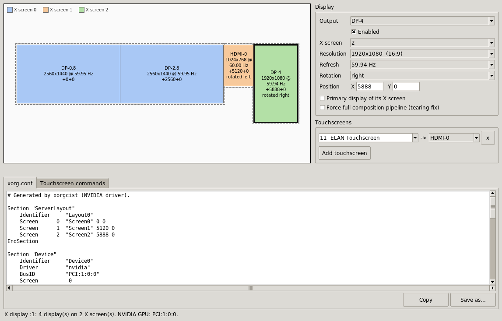

# xorgcist

[](https://github.com/nreagan/xorgcist/actions/workflows/test.yml)

A Linux GUI for X11 multi-display and input configuration — the things nvidia-settings stopped doing well.

It reads your current setup, lets you visually edit display layout, input routing, and touchscreen mapping, and emits `xorg.conf` snippets and `xinput` commands as text for you to save wherever you want. Built for the X11-bound niches — sim rigs, kiosks, GPU passthrough, facility multi-display — that aren't migrating to Wayland.



## Install and use

**Requirements**

- Linux running an X11 session (not Wayland)
- Python 3.10 or 3.11 (dearpygui 1.9.0 has no wheels for 3.12+)
- `xrandr`, `xinput`, and `lspci` on `PATH` (standard on any X11 desktop)

> **glibc note**: `requirements.txt` pins `dearpygui<=1.9.0` because 1.9.1+ require glibc 2.29+. RHEL8 ships glibc 2.28, so newer wheels install but fail at import. If you're on a newer distro you can lift the cap, but the pinned version works everywhere.

**Install**

```sh
git clone https://github.com/nreagan/xorgcist.git
cd xorgcist
pip install -r requirements.txt
```

If you'd rather not touch system Python, use a venv or `pipx`:

```sh
python3 -m venv .venv && source .venv/bin/activate
pip install -r requirements.txt
```

**Run**

```sh
python3 xorgcist.py
```

If you want to poke at the UI without a real X11 session (e.g. on a Wayland machine), launch with synthetic data:

```sh
python3 xorgcist.py --demo
```

**Workflow**

1. xorgcist opens populated with your current displays, input devices, and touchscreens — pulled from `xrandr`, `xinput`, and your existing `xorg.conf`.
2. Edit any of the three independent sections (display layout, input routing, touchscreen mapping). Skip the ones you don't need.
3. Review the generated `xorg.conf` snippet and runtime `xrandr` script in the preview panes. The built-in validator lints them on every change.
4. Save via the standard file dialog or copy to clipboard. xorgcist does not pick paths or install anything for you — drop the snippet into `/etc/X11/xorg.conf.d/`, an autostart script, version control, or wherever fits your setup. The real test is loading it in your actual X session.

> **Shell note:** the generated runtime script is POSIX sh. It works as-is in `.xinitrc`, autostart `Exec=`, systemd user units, or anywhere `/bin/sh` runs it (every Linux distro). Multi-X-screen scripts derive the X server number from `$DISPLAY` at runtime, so the same script works whether you log in first (`:0`), second (`:1`), or under multi-seat. csh users running it as a file are fine; csh users sourcing it interactively will need to wrap it (`sh runtime.sh`) since csh doesn't grok `VAR=value cmd` syntax.

**Run the tests**

```sh
python3 -m unittest test_xorgcist.py
```

## What it does

On launch, xorgcist reads your current `xorg.conf` and live `xrandr` / `xinput` state and presents three independent editors:

- **Display layout** — drag displays into position with absolute or relative offsets; assign displays to separate X screen IDs (`:0.0`, `:0.1`, …). This is the piece nvidia-settings used to do and no longer does.
- **Input device routing** — assign keyboards, mice, tablets, and touchscreens to specific outputs or screens.
- **Touchscreen mapping** — derives the `Coordinate Transformation Matrix` from the display layout so a touchscreen maps cleanly to the rectangle of its physical output.

Each editor is independent. Use any subset; skip the rest.

## How it works

xorgcist is a file emitter, not a config applier. Each editor produces standard `xorg.conf` snippets or `xinput` commands as plain text, exposed through a normal Save dialog and a Copy-to-clipboard button. There is no daemon, no sudo, no install workflow, no auto-revert. You review the generated text and decide where to put it — `/etc/X11/xorg.conf.d/`, an autostart script, version control, wherever fits your setup.

A built-in validator lints the generated config before you save: required sections present, `ServerLayout` references resolve, no duplicate identifiers, BusIDs syntactically valid. For full validation that the config actually loads, install it in your real X session — there is intentionally no in-app dummy-driver dryrun, because the modern Linux session-security stack (Xorg.wrap, sticky-bit `/tmp`, root-owned X locks, dummy driver semantic gaps) makes such sandboxes brittle and low-value.

## Audience

Power users on X11 by choice: simulator and arcade rigs, kiosk and digital signage operators, multi-seat lab and classroom setups, GPU passthrough hosts, accessibility installations, Wacom-heavy creative workflows, retro and specialty hardware, facility multi-display installations.

If your current workflow is "open nvidia-settings for the bits it still does, then hand-edit `xorg.conf` for the bits it doesn't," xorgcist is for you.

## Non-goals

- Wayland support
- Cross-session sync, cloud, fleet management
- Bundled "profile" abstractions on top of the saved files
- Device-level touchscreen calibration (tap-target routines for misbehaving panels)
- Anything that runs in the background or modifies system files on your behalf

## Stack

Python 3 + [Dear PyGui](https://github.com/hoffstadt/DearPyGui) — a native immediate-mode GUI framework. The whole UI is described fresh each frame from a single `UIState` dataclass; event handlers mutate state and the next frame reflects it. No widget-vs-app-state desync, snapshot-undo for free, trivial to test by asserting against `UIState` without rendering. Dear PyGui renders via OpenGL, which is reliably available on any system running an X session. Tests use stdlib `unittest`.

**Driver coverage.** xorgcist emits two artifacts per save: a `xorg.conf` snippet and a runtime `xrandr` script.

- **NVIDIA proprietary** is the primary supported driver. The xorg.conf uses NVIDIA's `MetaModes` to encode per-output positioning, rotation, mirror, and refresh inside the config file itself. The runtime script is redundant but consistent.
- **AMD (`amdgpu`)** and **Intel (`modesetting` / `i915`)** ignore `MetaModes` entirely — for these drivers, the xorg.conf only sets up the X screens (which is universal X11) and the actual layout (positioning / rotation / mirror / scale / primary / disable) comes from the runtime `xrandr` script. The script is written to be portable across all drivers, with `DISPLAY=:0.M` prefixes for multi-X-screen setups so xrandr targets the right screen.

In practice: NVIDIA users can rely on xorg.conf alone; AMD/Intel users need the runtime script to be wired into their session startup (autostart, `.xinitrc`, systemd user unit, etc.). Both paths are emitted from the same UI.

## License

MIT — see [LICENSE](LICENSE).
